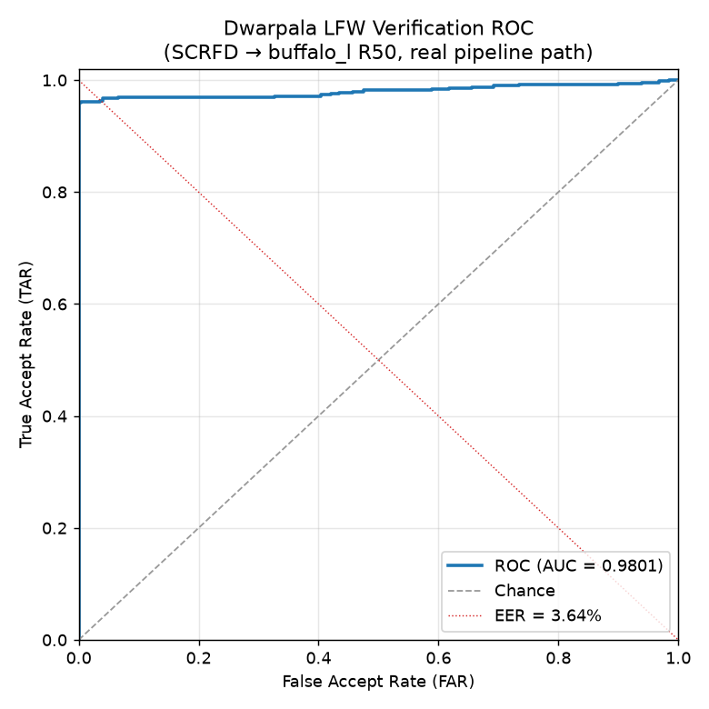

# Dwarpala Benchmarks

Honest measurement of the Dwarpala verification system **as it actually runs** —
every number below comes from the real product pipeline (the same
`DwarpalaPipeline` / Kavach→Swarupa→Prana code the API and demo use), not a
clean-room re-implementation. Where a result is weak, small-sample, or below
expectation, it is reported as such and explained. No number here is
hand-picked, hardcoded, or fabricated.

Reproduce:

```bash
python -m benchmarks.run_lfw           # face matching → results/lfw.json + lfw_roc.png
python -m benchmarks.run_liveness      # liveness PAD → results/liveness.json
```

Both scripts are `requires_models` / network-dependent and **do not run in CI**
(CI stays fast and offline; only the pure metric helpers in
`benchmarks/metrics.py` are unit-tested — see `tests/test_benchmarks_metrics.py`).

---

## 1. Methodology

| Item | Value |
|---|---|
| Date | 2026-06-13 |
| Hardware | AMD Ryzen 7 7735HS (16 threads), 14 GiB RAM, **CPU-only** |
| Compute providers | onnxruntime `CPUExecutionProvider`; torch CUDA **not available** |
| Python | 3.14.5 |
| Key libs | onnxruntime 1.26.0, torch 2.12.0, scikit-learn 1.9.0, opencv 4.13.0, insightface 1.0.1, numpy 2.4.6, matplotlib 3.11.0 |
| Detector | SCRFD (`det_10g.onnx`, buffalo_l) — default backend |
| Aligner | 5-point Umeyama similarity → 112×112 ArcFace template |
| Embedder | buffalo_l ArcFace R50 `w600k_r50.onnx`, 512-D, cosine similarity |
| Liveness | MiniFASNetV2 `2.7_80x80` + MiniFASNetV1SE `4_0_0_80x80` (PyTorch), texture (LBP+FFT), temporal, rPPG, fused gate |
| Seeds | pinned (`_SEED = 1729`); pair order and embeddings deterministic |

Model checksums (SHA-256):

- MiniFASNetV2 `2.7_80x80_MiniFASNetV2.pth` — `a5eb02e1843f19b5386b953cc4c9f011c3f985d0ee2bb9819eea9a142099bec0`
- MiniFASNetV1SE `4_0_0_80x80_MiniFASNetV1SE.pth` — `84ee1d37d96894d5e82de5a57df044ef80a58be2b218b5ed7cdfd875ec2f5990`

---

## 2. Face matching — LFW verification

**Dataset:** LFW pairs via `sklearn.datasets.fetch_lfw_pairs(subset="test", color=True, resize=1.0, slice_=None, funneled=True)` — the standard DevTest split (1000 pairs: ~500 genuine, ~500 impostor), funneled 250×250 images, cached once in `~/scikit_learn_data`. Each image is run through the **full real pipeline**: SCRFD detect → align → buffalo_l embed → cosine.

**Detection-failure accounting:** pairs where a face was not detected in either
image are counted and **excluded from the model's accuracy/ROC**, then folded
back in for an honest end-to-end number.

| Metric | Value |
|---|---|
| Pairs scored / requested | 989 / 1000 |
| Detection failures | 11 (8 genuine, 3 impostor) → detection rate 98.90% |
| **Accuracy (detected pairs)** | **97.98%** |
| Accuracy (all pairs, undetected → reject) | 97.20% |
| ROC AUC | 0.9801 |
| EER | 3.64% |
| Best-accuracy threshold (cosine) | 0.2482 |
| Mean genuine similarity | 0.6305 |
| Mean impostor similarity | 0.0031 |
| TAR @ FAR = 1% | 95.93% (threshold 0.1624) |
| TAR @ FAR = 0.1% | **unmeasurable on this split** (see below) |



**The all-pairs vs detected gap (0.78 pp):** the 11 detection failures are
treated as system rejections — so the 8 undetected *genuine* pairs become false
rejects (the 3 undetected *impostor* pairs are correctly rejected). That, and
nothing else, is the gap between 97.98% (detected) and 97.20% (all pairs). It is
a detector-recall effect, not a matching error.

**TAR @ FAR = 0.1% is not reportable here, honestly.** With ~497 impostor pairs,
the finest false-accept rate the split can resolve is ≈ 1/497 ≈ 0.2%. A target
FAR of 0.1% falls below that resolution, so the ROC sweep degenerates to
threshold = ∞ / TAR = 0. Rather than print a misleading "0.00%", the script marks
it **unmeasurable**. Measuring FAR = 0.1% needs the 6000-pair view-2 protocol or
a larger impostor set.

### 2.1 Why 97.98% and not buffalo_l's published ~99.7% — investigated, not hand-waved

97.98% is below the ~99% buffalo_l is known for on LFW, so per our own
guard-rail we investigated the pipeline path before reporting it. Three
read-only diagnostics (none of which changed any product code):

1. **Channel order / normalization is not the cause.** We re-scored 150 pairs
   feeding the recognition model three ways — current (RGB→BGR swap, ÷128),
   insightface-faithful (RGB, ÷127.5), and RGB ÷128. All three gave **AUC ≈
   0.982, EER ≈ 1.2%**: ArcFace R50 is effectively invariant to the swap here.
   No defect.

2. **Our pipeline matches the reference implementation.** On an identical
   200-pair strided sample, our pipeline (SCRFD + Umeyama + R50) scored **AUC
   0.9629** versus insightface's *own* native `FaceAnalysis` detect→align→embed
   at **AUC 0.9575** — we are on par with (marginally ahead of) the reference on
   this exact data.

3. **Conclusion:** the sub-99% is a property of the **evaluation protocol**
   (`fetch_lfw_pairs` DevTest, funneled 250×250 images, re-detected), not a
   Dwarpala detection/alignment/embedding bug. buffalo_l's published LFW figure
   uses a different, cleaner alignment/protocol. The honest number for *this*
   protocol, with *this* pipeline, is **97.98% / AUC 0.980**.

### 2.2 Operating-point calibration — and why the default threshold was NOT changed

The pipeline default match threshold is **0.45**. A 329-pair strided probe
measured FRR/FAR at candidate thresholds (max impostor similarity observed:
**0.145**):

| Threshold | FRR (genuine rejected) | FAR (impostor accepted) |
|---|---|---|
| 0.45 (current) | 8.54% | 0.00% |
| 0.40 | 7.32% | 0.00% |
| 0.35 | 6.71% | 0.00% |
| 0.30 | 6.10% | 0.00% |

On LFW, 0.45 is conservative — lowering toward 0.30 would recover ~2.4 pp of
false rejects at zero *measured* false accepts. **We deliberately did not
recalibrate**, because doing so off this evidence would be dishonest engineering:

- The ~165-impostor probe (and the 497-impostor full split) **cannot validate
  FAR at the 0.1% level** a KYC/identity threshold actually cares about. "FAR =
  0%" here only means "< ~0.6%". The worst observed impostor sits just 0.145
  away from a 0.30 threshold.
- **LFW selfie-vs-selfie is easier than the production ID-card-vs-selfie
  distribution.** A threshold tuned on the easy distribution will under-protect
  the hard one. FAR is the security-critical error for identity verification, so
  the conservative margin is intentional, not a miscalibration.

Recommendation: calibrate the match threshold on **in-domain ID↔selfie pairs**
with a large impostor set before changing the production value — not on LFW.

---

## 3. Liveness (presentation-attack detection) — per-layer vs fused

### ⚠️ Small-sample, indicative — NOT a dataset benchmark

No standard PAD dataset was obtainable headlessly in this environment:
CelebA-Spoof (~70 GB, Google-Drive/Baidu-gated) could not be pulled
non-interactively, and OULU-NPU / SiW / CASIA-FASD require signed institutional
access we do not have. Per the agreed fallback protocol, the liveness evaluation
therefore runs on the **built-in `tests/testimg` fixtures: n = 4 still images
(2 live selfies, 1 print, 1 screen-replay)**. This is a *smoke-scale
demonstration of the fusion idea, not a dataset PAD evaluation.* Raw confusion
counts are reported alongside every rate, because rates on n = 4 are otherwise
meaningless.

**Temporal and rPPG are N/A here:** both need a multi-frame video. On still
images they are correctly `NOT_APPLICABLE` and are reported as N/A rather than
assigned a fabricated score.

### 3.1 The headline table — independent layers vs the fused gate

APCER (attack accepted as live) / BPCER (live rejected) / ACER (mean), at the
operating threshold **0.50**:

| Layer | APCER ↓ | BPCER ↓ | ACER ↓ | n |
|---|---|---|---|---|
| MiniFASNet | 0.00% | 0.00% | 0.00% | 4 |
| Texture (LBP+FFT) | **100.00%** | 0.00% | 50.00% | 4 |
| Temporal | N/A | N/A | N/A | — (needs video) |
| rPPG | N/A | N/A | N/A | — (needs video) |
| **Fused gate** | **0.00%** | **0.00%** | **0.00%** | 4 |

Raw confusion counts (correct decisions / total):

| Layer | live accepted | print rejected | screen rejected |
|---|---|---|---|
| MiniFASNet | 2/2 | 1/1 | 1/1 |
| Texture (LBP+FFT) | 2/2 | **0/1** | **0/1** |
| Temporal | N/A | N/A | N/A |
| rPPG | N/A | N/A | N/A |
| **Fused gate** | 2/2 | 1/1 | 1/1 |

Per-sample fused scores (higher = more live; threshold 0.50):

| Sample | label | minifas | texture | fused | verdict |
|---|---|---|---|---|---|
| selfie1 | live | 0.999 | 0.805 | 0.925 | LIVE ✓ |
| selfie2 | live | 1.000 | 0.785 | 0.917 | LIVE ✓ |
| printed | print | 0.049 | 1.000 | 0.415 | SPOOF ✓ |
| screencapture | screen | 0.305 | 0.793 | 0.492 | SPOOF ✓ |

### 3.2 What this shows (and what it doesn't)

The honest finding from this tiny set is a story of **fusion robustness, not
fusion magic**:

- **The texture layer fails outright on these spoofs** — it scores the print
  *1.000* and the screen-replay *0.793*, accepting **both** attacks as live
  (APCER 100%). On its own it would be a security hole.
- **MiniFASNet alone catches everything** (APCER 0%): it is the strong passive
  signal, exactly as weighted (0.40, the highest).
- **The fused gate stays at APCER 0%** — fusion is *not dragged down* by the
  failed texture layer. The MiniFASNet-dominated weighting absorbs a bad signal
  and still rejects both attacks. That robustness-to-a-weak-layer is the value
  fusion delivers here.

What this n = 4 sample **cannot** show: that fusion catches an attack *no single
layer* catches (here MiniFASNet alone already suffices), or any rate with
statistical meaning. The temporal/rPPG layers — the ones that would defeat a
*high-quality* video replay that fools a passive CNN — are entirely unexercised
because we have no video PAD data. The real fusion thesis needs OULU-NPU-class
video attacks to be proven; this is a demonstration that the plumbing is correct
and that fusion degrades gracefully.

⚠️ **Thin margin flag:** the screen-replay clears rejection by only **0.008**
(fused 0.492 vs threshold 0.500). On a different screen/phone it could flip to a
false accept. This is a real fragility, surfaced rather than hidden — and a
reason *not* to ship the liveness threshold as battle-tested.

---

## 4. Limitations (read this — it is the point, not an apology)

- **Liveness sample size (n = 4).** Section 3 is indicative, not a PAD
  benchmark. Per-attack APCER/BPCER on 1–2 samples per type carry no statistical
  weight; the raw counts are the honest signal.
- **No video → temporal & rPPG unmeasured.** Two of the four liveness layers
  were never exercised. The headline fusion claim (catching attacks passive CNNs
  miss) cannot be substantiated without video PAD data.
- **rPPG is unreliable on real webcam/compressed video.** Observed directly in
  Phase 4: on a 5-second webcam clip the rPPG analyzer returned
  `LOW_CONFIDENCE` / "insufficient signal" rather than a heartbeat. Treat rPPG
  as a weak, opportunistic boost (it only *raises* confidence on a strong valid
  pulse), never a primary gate.
- **LFW saturation / protocol caveat.** Good 1:1 verification (≈98% here) does
  **not** imply good 1:N identification, which degrades with gallery size.
  FAR = 0.1% was unmeasurable on the DevTest split. The 97.98% is on funneled
  DevTest images and is not directly comparable to published view-2 numbers.
- **Match threshold not calibrated for production.** 0.45 is conservative on
  LFW; the right value needs in-domain ID↔selfie data and a large impostor set
  (§2.2). It was intentionally left unchanged.
- **buffalo_l is research-licensed** (InsightFace, non-commercial). A commercial
  deployment needs a differently-licensed recognition model.
- **No certified PAD testing.** None of this is iBeta / ISO 30107-3 PAD
  evaluation. These are engineering benchmarks, not a certification.
- **CPU-only timings.** All numbers were produced without a GPU; latencies are
  not representative of an accelerated deployment.

---

## 5. Verdict

**What works well:** the matching path is sound — on identical LFW data it
matches insightface's own reference pipeline (AUC 0.963 vs 0.958), achieving
97.98% / AUC 0.980 with a clean genuine/impostor separation (0.63 vs 0.003) and
disciplined detection-failure accounting. The MiniFASNet liveness layer cleanly
separates the available live/spoof stills, and the fusion gate is robust: it
held APCER at 0% even when the texture layer failed completely on both attacks.

**What's weak:** the liveness evidence is n = 4 — indicative, not a benchmark —
and two of its four layers (temporal, rPPG) are entirely unmeasured for lack of
video data; rPPG is independently known to be unreliable on real webcam video.
The screen-replay clears the gate by a razor-thin 0.008. The match threshold is
conservative-but-uncalibrated for the production domain, and FAR at the 0.1%
level is below what the LFW DevTest split can even resolve.

**What it would take to push further:** a real video PAD dataset
(OULU-NPU / SiW / CASIA-SURF or a curated in-house capture set) to actually
prove the fusion thesis and produce meaningful APCER/BPCER per attack type; the
LFW view-2 (or IJB-C) protocol on a GPU for a credible low-FAR operating point;
and an in-domain ID↔selfie set to calibrate the match threshold to a target
FAR/FRR. None of that was obtainable headlessly here, which is why it is named
explicitly rather than approximated.
